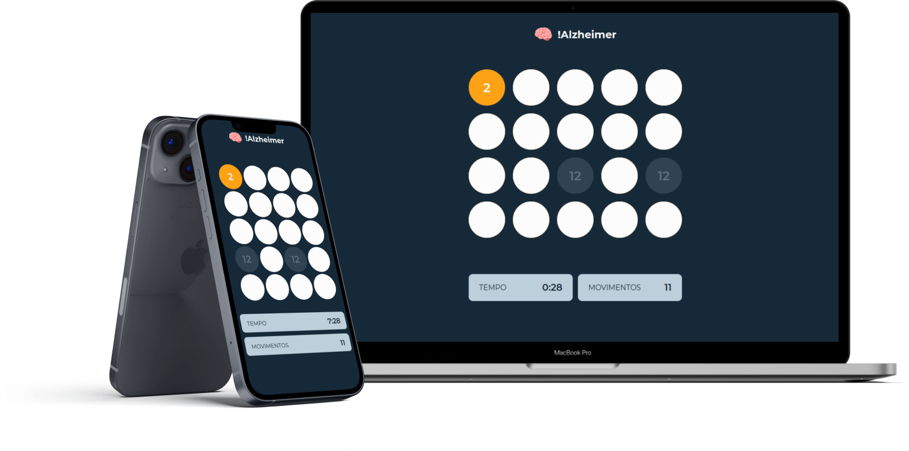

# !Alzheimer
Jogo da memória criado para estudo da biblioteca ReactJS. Para acessar o projeto online, [clique aqui](https://alzheimer.vercel.app) e divirta-se.

# Design


O design da aplicação foi criado no [Figma](https://figma.com), inspirado no desafio ["Memory game"](https://www.frontendmentor.io/challenges/memory-game-vse4WFPvM) do Frontend Mentor.

# Execução em ambiente de desenvolvimento
Primeiramente, é necessário ter [Git](https://git-scm.com/download) e [NodeJS](https://nodejs.org) instalados na máquina. Em seguida, pode-se executar os seguintes comandos no terminal:

```
1) Clonar o repositório:
git clone https://github.com/filipealvess/alzheimer.git

2) Acessar a pasta do projeto:
cd alzheimer

3) Instalar as dependências do projeto:
npm install

4) Iniciar o projeto:
npm start

5) Acessar "localhost:3000" no navegador e ser feliz!
```